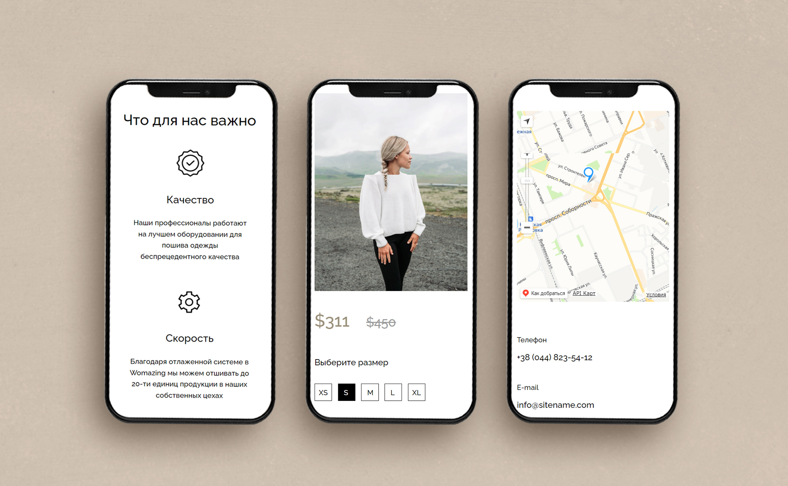

<h1 align="center">Womazing</h1>

<h2 align="center"><a  href="https://akkeluck.github.io/womazing-shop/index.html">Demo</a></h2>

## Description
<table>
<tr>
<td>
  A training project presented as a multipage online store that aims at practicing web development and mastering such skills as HTML, CSS, and JavaScript (JQuery).
</td>
</tr>
</table>

## Responsive Web Design
The website is compatible with screen sizes of all resolutions.

## Built with 

- [jQuery Validation Plugin](https://jqueryvalidation.org/)
- [Yandex.Maps JavaScript API](https://yandex.ru/dev/maps/jsapi/)
- [Slick Slider](https://kenwheeler.github.io/slick/)

## Future scope

- Implement an option to add items to the cart / remove them.
